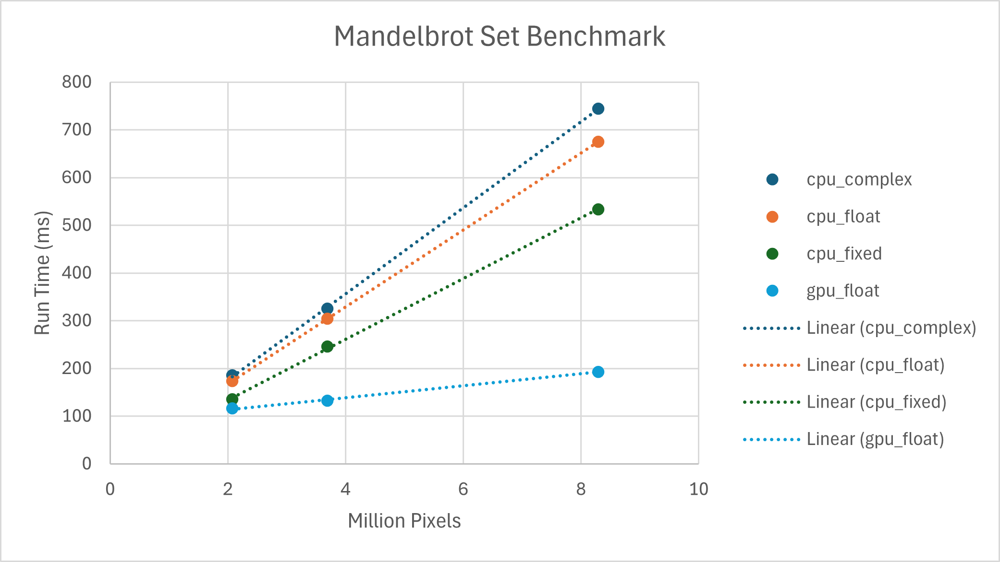

# Mandelbrot Set

Mandelbrot set is a mathematical fractal on complex plane. Rendering it requires lots of computation, but it is an embarassingly parallel task. This repository contains multiple implementations of mandelbrot set rendering algorithms on different devices like CPU, GPU and FPGA.


## Build

```
cd cpu
mkdir build && cd build
cmake .. -DCMAKE_BUILD_TYPE=Release
make
```

## Run 

* CPU: `./mandelbrot -c ${mode} -w {image_width} -h {image_height}`
* GPU: `./mandelbrot -w {image_width} -h {image_height}`

Note: `${mode}` is only available for CPU implementation and it can be either `complex`, `float` or `fixed`.

1. `complex`: Uses `complex.h` from standard C library to perform complex number calculations.
2. `float`: Uses float with optimized instructions to perform calculation (see [Wikipedia](https://en.wikipedia.org/wiki/Plotting_algorithms_for_the_Mandelbrot_set#Optimized_escape_time_algorithms))
3. `fixed`: Same implementation as `float` but uses fixed-point integer with radix at 24th bit instead.


## Benchmark

The table below is obtained using [hyperfine](https://github.com/sharkdp/hyperfine) wuth 3 warm-up runs and 10 runs. The unit is milliseconds, so the lower the better.

Device Specification:
* CPU: Ryzen9-5900X
* GPU: EVGA RTX 3070
* RAM: 125 GiB
* OS: Ubuntu 20.04.6 LTS

| Implementation | FHD (1920 x 1080) | 2K (2560 x 1440) | 4K (3840 x 2160) |
| -------------- | ----------------- | ---------------- | ---------------- |
| `cpu_complex`  | 185.6             | 324.9            | 744.6            |
| `cpu_float`    | 174.0             | 304.2            | 675.4            |
| `cpu_fixed`    | 135.1             | 246.2            | 533.3            |
| `gpu_float`    | 116.0             | 132.3            | 193.0            |




## Conclusion

1. Run time of Mandelbrot Set rendering algorithm has strong linear relationship with number of pixels.
2. GPU is always faster than CPU. Also, run times on GPU grow much slower than CPU as number of pixels increase.
3. On CPU, integer (fixed-point) operations are much faster, though it may have lower accuracy comparing to float.
